---
## Author
author:
  name: Лаптев Тимофей Сергеевич
  degrees:
  orcid:
  email: 1132243021@pfur.ru
  affiliation:
    - name: Российский университет дружбы народов
      country: Российская Федерация
      postal-code: 117198
      city: Москва
      address: ул. Миклухо-Маклая, д. 6

## Title
title: "Разбор тестовых заданий по сетевым протоколам, куки, TOR и Wi-Fi"
subtitle: "Презентация к реферату по дисциплине «Основы информационной безопасности»"
license: CC BY
date: today
date-format: "YYYY-MM-DD"
lang: ru-RU

format:
  beamer:
    pdf-engine: xelatex
    mainfont: "DejaVu Serif"
    sansfont: "DejaVu Sans"
    monofont: "DejaVu Sans Mono"
    toc: false
    number-sections: false
    colorlinks: false
    slide_level: 2
    aspectratio: 169
    section-titles: false
    theme: metropolis
    themeoptions: progressbar=frametitle,numbering=fraction
    babel-lang: russian
    babel-otherlangs: english

  revealjs:
    transition: slide
    margin: 0.2
    smaller: false
    output-ext: html
    theme: beige
---

# Информация о докладчике

:::::::::::::: {.columns align=center}
::: {.column width="70%"}

- Лаптев Тимофей Сергеевич
- Студент, направление НКАбд
- Российский университет дружбы народов
- Дисциплина: Основы информационной безопасности
- Тема: разбор тестовых заданий

:::
::: {.column width="30%"}

:::
::::::::::::::

# Протокол прикладного уровня

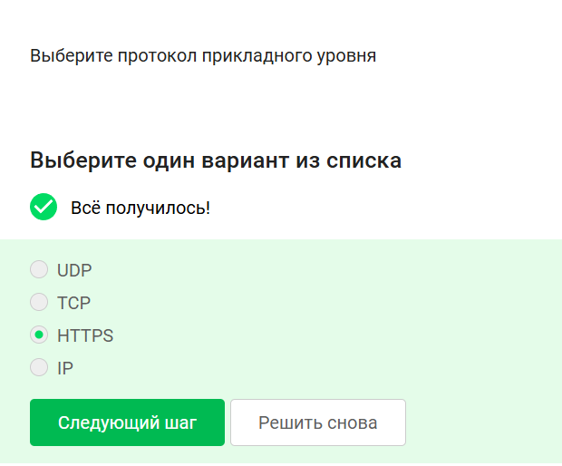

# Уровень протокола TCP

# Корректные IPv4-адреса

# DNS сервер

# Последовательность протоколов TCP/IP

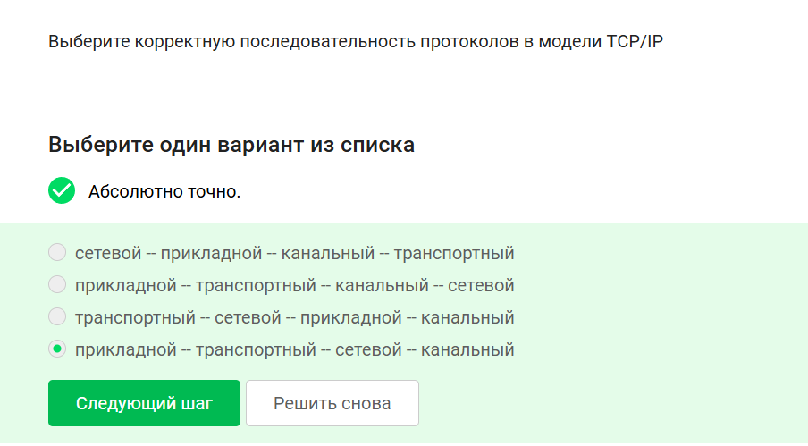

# Протокол HTTP

# Протокол HTTPS

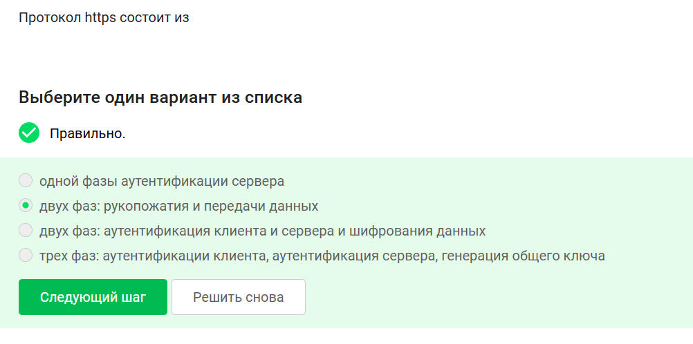

# Что хранят куки

# Для чего НЕ используются куки

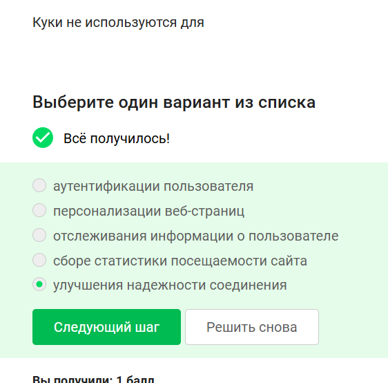

# Сессионные куки

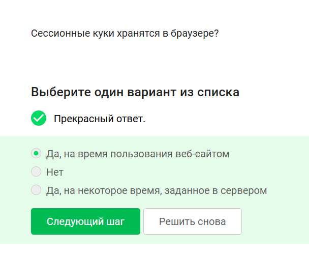

# Промежуточные узлы TOR

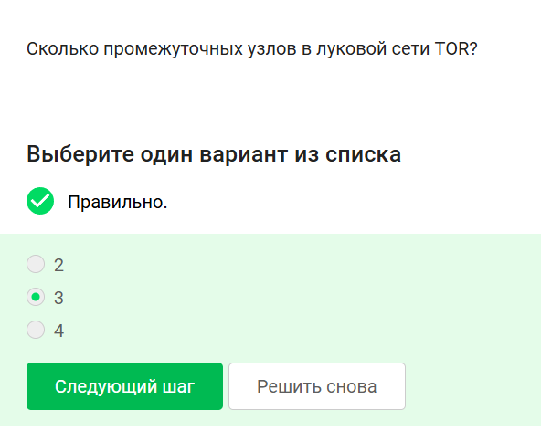

# Кому известна информация в TOR

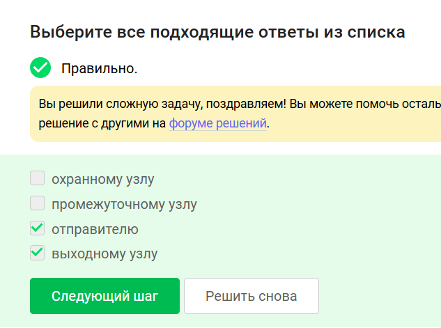

# Генерация секретного ключа в TOR

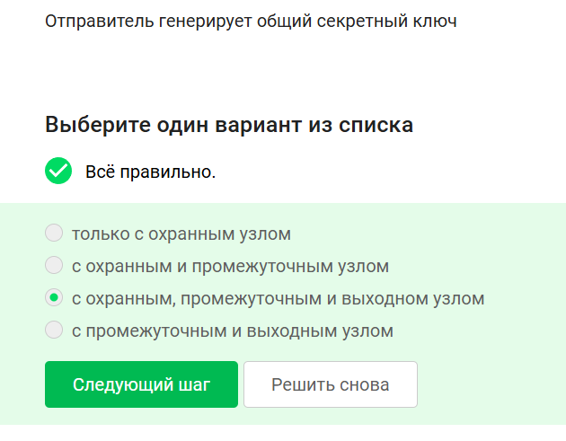

# Получатель и браузер Tor

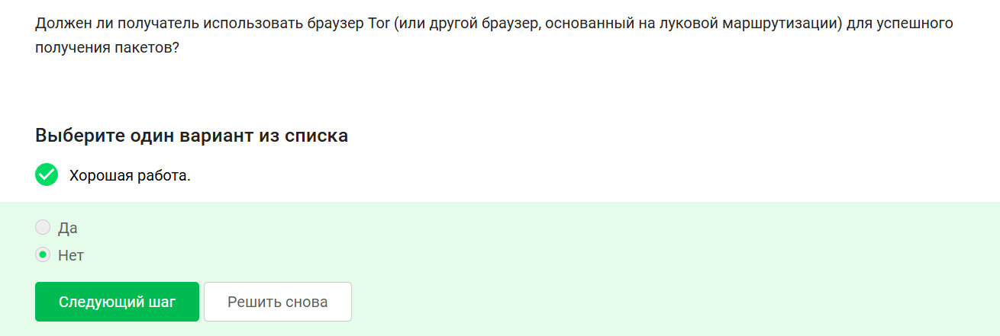

# Что такое Wi-Fi

# Небезопасный метод Wi-Fi

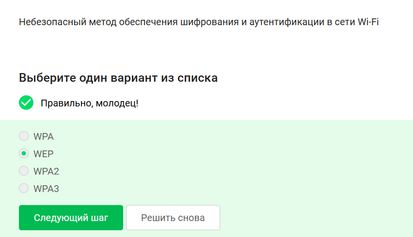

# Передача данных хост-роутер

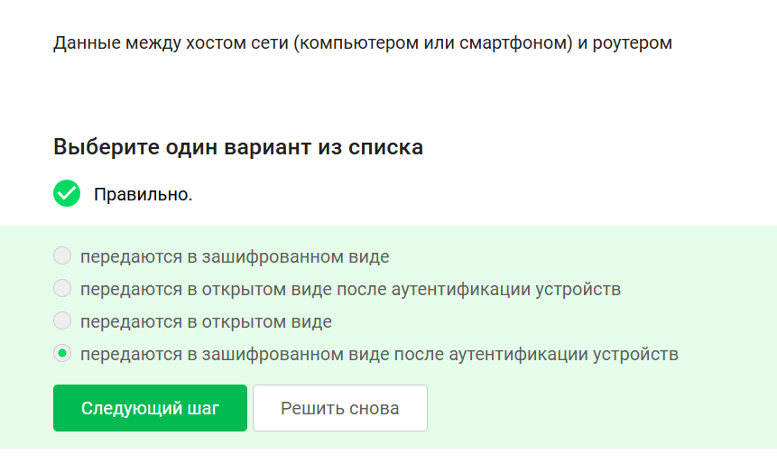

# Спасибо за внимание

