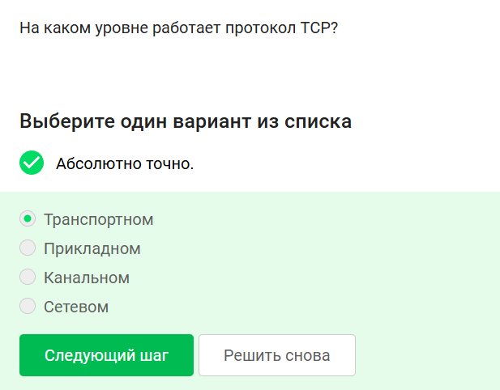
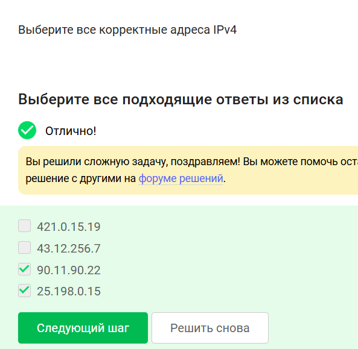
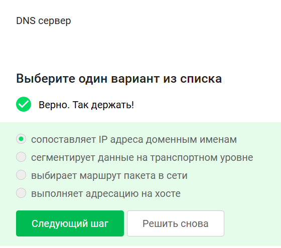
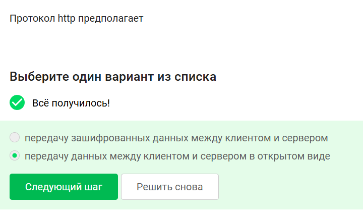
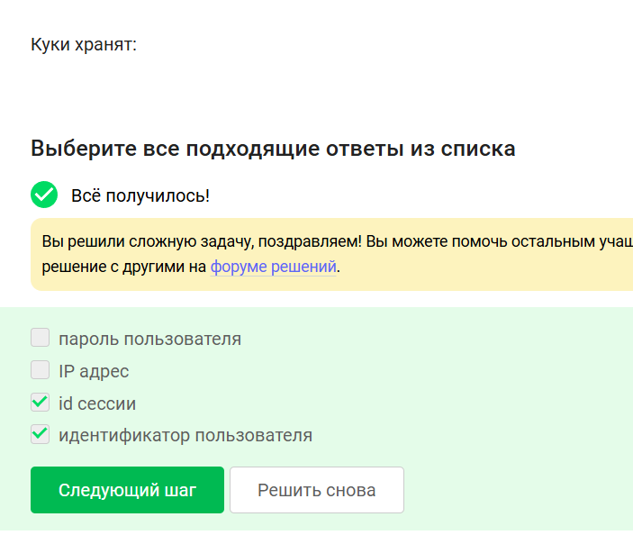
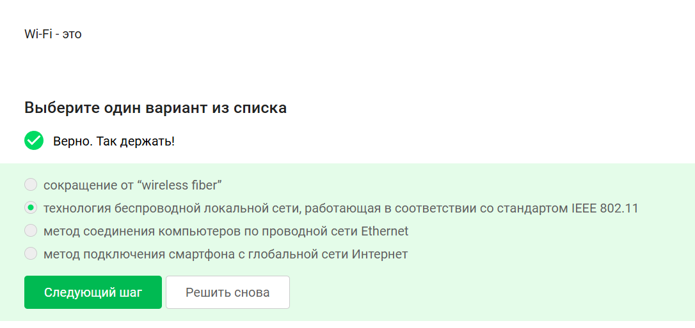

# Цель работы

Систематизировать знания по сетевым технологиям и безопасности на основе анализа тестовых заданий, закрепляя каждый вопрос визуальным материалом.

# 1. Протоколы прикладного уровня

**Правильный ответ:** HTTPS.  
Пояснение: UDP и TCP работают на транспортном уровне, IP — на сетевом. HTTPS — прикладной протокол.

# 2. Уровень протокола TCP

**Правильный ответ:** Транспортный.

# 3. Корректные IPv4-адреса

**Правильные ответы:** 90.11.90.22 и 25.198.0.15.  
Адреса 421.0.15.19 и 43.12.256.7 недопустимы (числа больше 255).

# 4. DNS сервер

**Правильный ответ:** сопоставляет IP адреса доменным именам.

# 5. Последовательность протоколов в модели TCP/IP

**Правильный ответ:** прикладной → транспортный → сетевой → канальный.

# 6. Протокол HTTP

**Правильный ответ:** передача данных в открытом виде.

# 7. Протокол HTTPS

**Правильный ответ:** две фазы: рукопожатия и передачи данных.

# 9. Что хранят куки

**Правильные ответы:** id сессии, идентификатор пользователя.

# 10. Для чего не используются куки

**Правильный ответ:** улучшение надежности соединения.

# 12. Сессионные куки

**Правильный ответ:** Да, на время пользования веб-сайтом.

# 13. Сколько промежуточных узлов в TOR

**Правильный ответ:** 2.

# 14. Кому известна информация в TOR

**Правильные ответы:** отправителю, выходному узлу.

# 15. Генерация общего секретного ключа в TOR

**Правильный ответ:** с охранным, промежуточным и выходным узлом.

# 16. Обязан ли получатель использовать Tor Browser

**Правильный ответ:** Нет.

# 17. Что такое Wi-Fi

**Правильный ответ:** технология беспроводной локальной сети IEEE 802.11.

# 18. Небезопасный метод шифрования Wi-Fi

**Правильный ответ:** WEP.

# 19. Передача данных между хостом и роутером

**Правильный ответ:** передаются в зашифрованном виде после аутентификации устройств.

# Заключение

Все рассмотренные тестовые вопросы охватывают ключевые темы курса: веб-протоколы, адресацию, DNS, куки, анонимные сети TOR и безопасность Wi-Fi. Визуальное закрепление каждого вопроса позволяет лучше запомнить правильные ответы и их обоснование.
