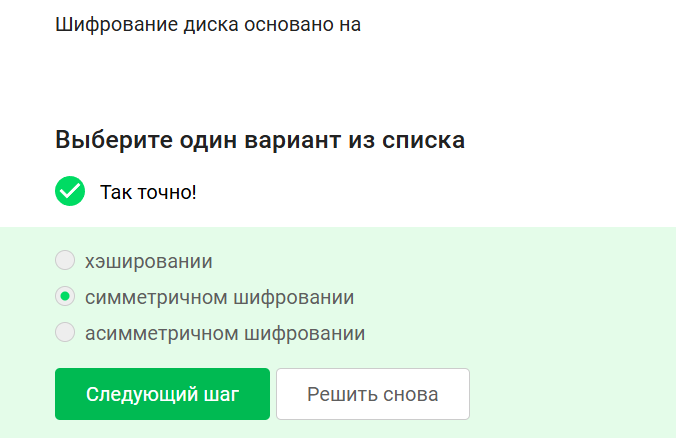
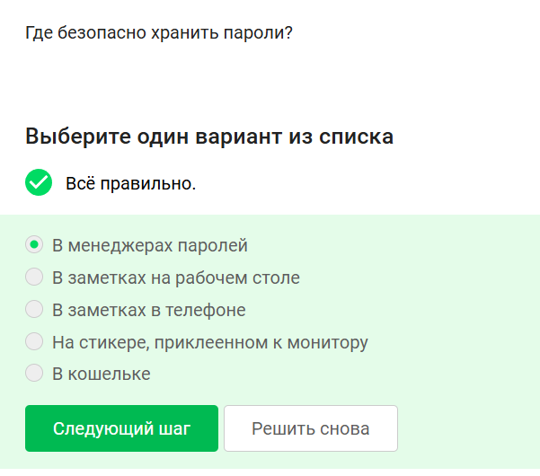
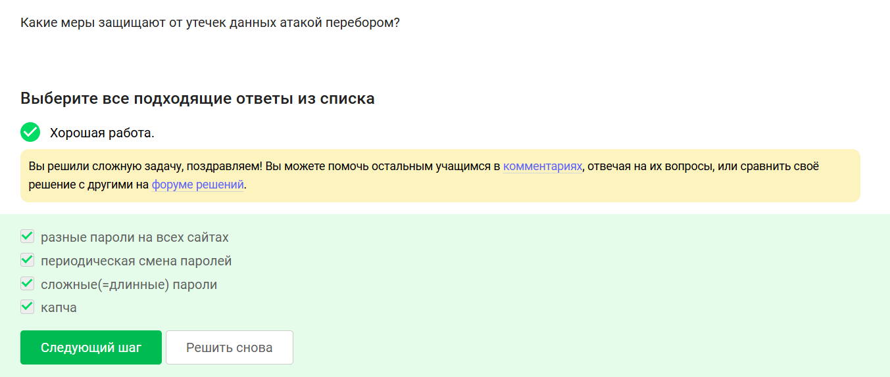

# Цель работы

Систематизировать знания по практическим аспектам информационной безопасности: шифрование дисков, стойкость паролей, хэширование, фишинг, трояны, сквозное шифрование в мессенджерах.

# 1. Шифрование загрузочного сектора

**Правильный ответ:** Да. Загрузочный сектор можно зашифровать с помощью средств полнодискового шифрования (например, BitLocker, VeraCrypt).

# 2. Основа шифрования диска

**Правильный ответ:** симметричное шифрование. Полнодисковое шифрование использует один ключ для шифрования и расшифровки данных.

# 3. Программы для шифрования диска

**Правильные ответы:** VeraCrypt, BitLocker. Disk Utility — утилита macOS для работы с дисками, но не специализированное средство шифрования всего диска (хотя может создавать зашифрованные образы). Wireshark — анализатор трафика.

# 4. Стойкие пароли

**Правильный ответ:** UQr9@j4!$§. Содержит символы разных регистров, цифры, спецсимволы, достаточную длину. Остальные — словарные или простые.

# 5. Безопасное хранение паролей

**Правильный ответ:** В менеджерах паролей. Остальные варианты небезопасны.

# 6. Назначение капчи

**Правильный ответ:** Для защиты от автоматизированных атак, направленных на получение несанкционированного доступа.

# 7. Хэширование паролей

**Правильный ответ:** Для того, чтобы не хранить пароли на сервере в открытом виде.

# 8. Соль для стойкости паролей

**Правильный ответ:** Да. Соль делает перебор по предвычисленным радужным таблицам неэффективным, даже при доступе к хэшам.

# 9. Меры защиты от атаки перебором

**Правильные ответы:** разные пароли на всех сайтах, периодическая смена паролей, сложные (длинные) пароли, капча. Все перечисленные меры помогают.

# 10. Фишинговые ссылки

**Правильные ответы:** online.sberbank.wix.ru (неофициальный домен), passport.yandex.ucoz.ru (ucoz — не Яндекс). Остальные — официальные.

# 11. Фишинговый имейл от знакомого адреса

**Правильный ответ:** Да. Злоумышленники могут подделать адрес отправителя (спуфинг) или взломать чужой аккаунт.

# 12. Email спуфинг

**Правильный ответ:** подмена адреса отправителя в имейлах.

# 13. Вирус-троян

**Правильный ответ:** маскируется под легитимную программу.

# 14. Формирование ключа в Signal

**Правильный ответ:** при каждом новом сообщении от стороны-отправителя (используется протокол двойного рейтлинга, ключи меняются для каждого сообщения).

# 15. Сквозное шифрование

**Правильный ответ:** сообщения передаются по узлам связи (серверам) в зашифрованном виде. Сервер не имеет доступа к открытому тексту.

# Заключение

Рассмотренные вопросы охватывают ключевые темы практической безопасности: полнодисковое шифрование, создание и хранение стойких паролей, хэширование с солью, защиту от перебора (капча, сложные пароли), распознавание фишинга, троянов, а также современные протоколы сквозного шифрования на примере Signal.
