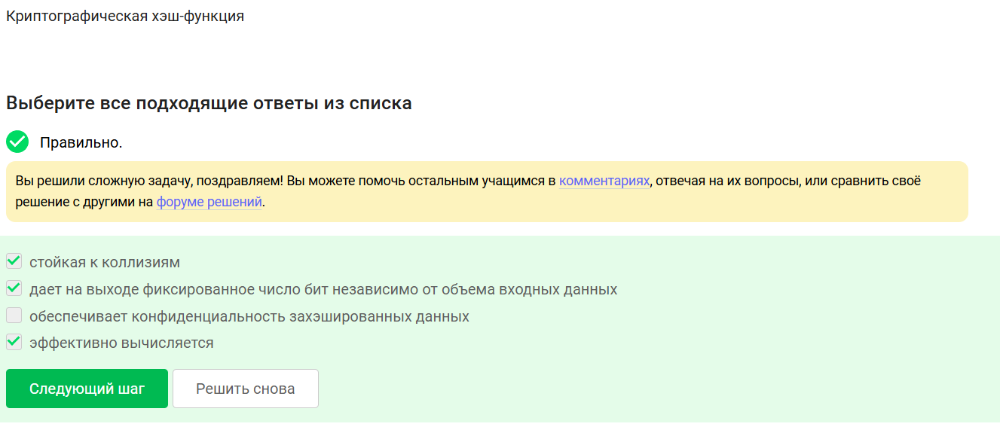
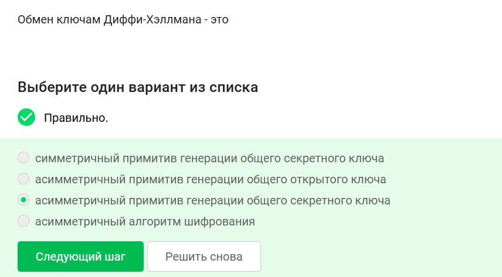
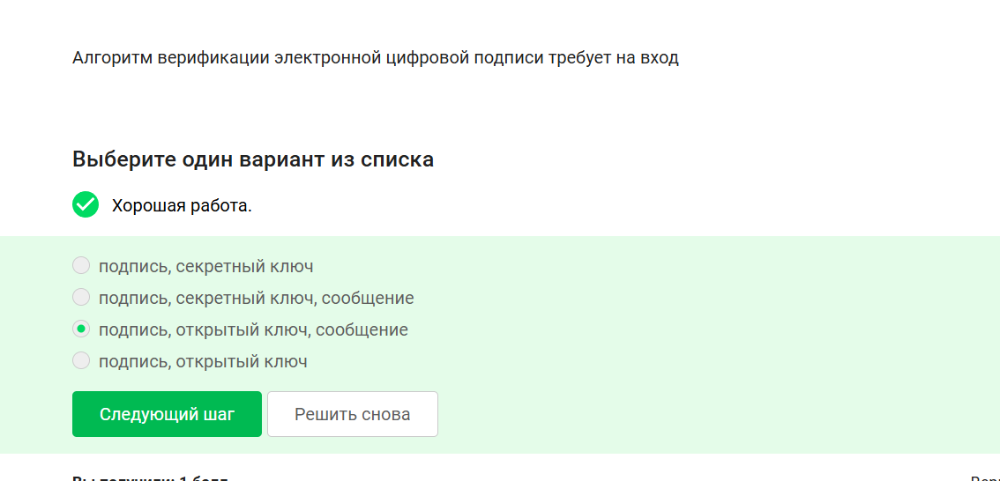
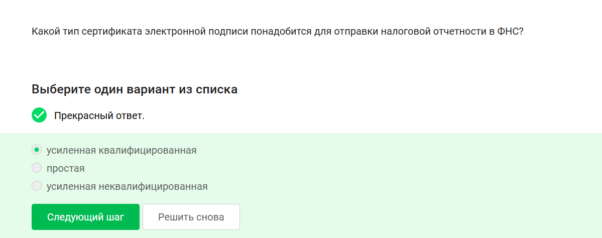
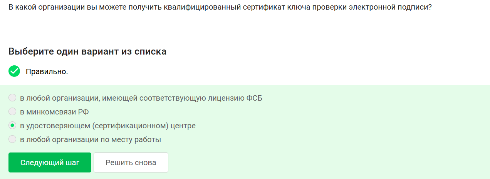
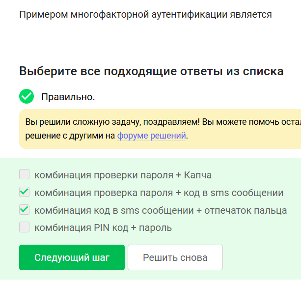
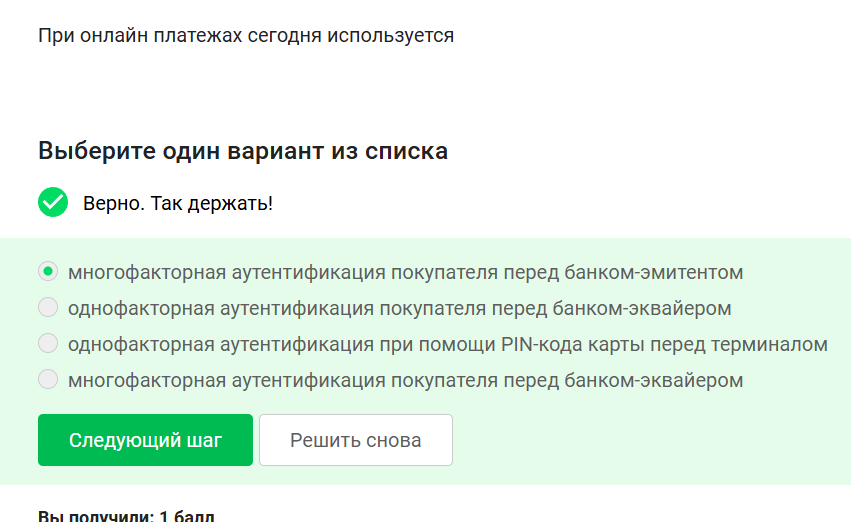
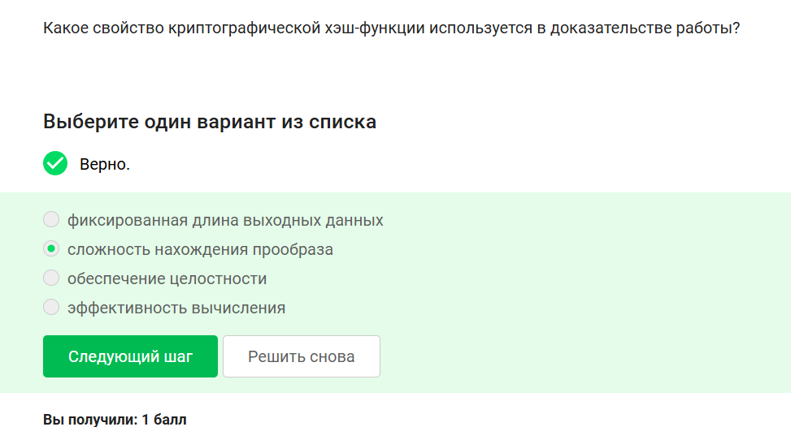
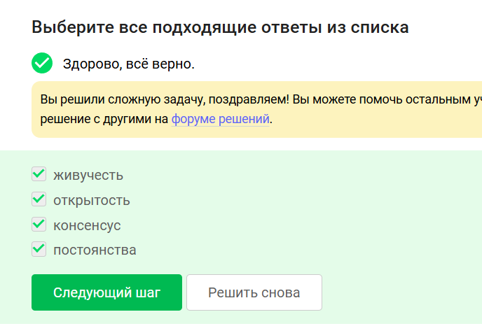

---
## Author
author:
  name: Лаптев Тимофей Сергеевич
  degrees:
  orcid:
  email: 1132243021@pfur.ru
  affiliation:
    - name: Российский университет дружбы народов
      country: Российская Федерация
      postal-code: 117198
      city: Москва
      address: ул. Миклухо-Маклая, д. 6

## Title
title: "Криптография, ЭЦП, сертификаты и блокчейн"
subtitle: "Презентация к реферату по дисциплине «Основы информационной безопасности»"
license: CC BY
date: today
date-format: "YYYY-MM-DD"
lang: ru-RU

format:
  beamer:
    pdf-engine: xelatex
    mainfont: "DejaVu Serif"
    sansfont: "DejaVu Sans"
    monofont: "DejaVu Sans Mono"
    toc: false
    number-sections: false
    colorlinks: false
    slide_level: 2
    aspectratio: 169
    section-titles: false
    theme: metropolis
    themeoptions: progressbar=frametitle,numbering=fraction
    babel-lang: russian
    babel-otherlangs: english

  revealjs:
    transition: slide
    margin: 0.2
    smaller: false
    output-ext: html
    theme: beige
---

# Информация о докладчике

:::::::::::::: {.columns align=center}
::: {.column width="70%"}

- Лаптев Тимофей Сергеевич
- Студент, направление НКАбд
- Российский университет дружбы народов
- Дисциплина: Основы информационной безопасности
- Тема: криптография, ЭЦП, блокчейн

:::
::: {.column width="30%"}

:::
::::::::::::::

# Асимметричные криптопримитивы

# Свойства хэш-функции

# Алгоритмы цифровой подписи

# Код аутентификации сообщения (MAC)

# Обмен ключами Диффи-Хэллмана

# Протокол ЭЦП

# Верификация ЭЦП

# Что не даёт ЭЦП

# Сертификат для налоговой

# Где получить квалифицированный сертификат

# Платёжные системы

# Многофакторная аутентификация

# Аутентификация при онлайн-платежах

# Свойство хэш-функции в PoW

# Свойства блокчейна

# Секретные ключи в блокчейне

# Спасибо за внимание

