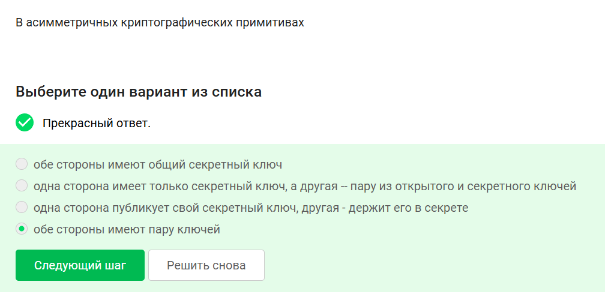
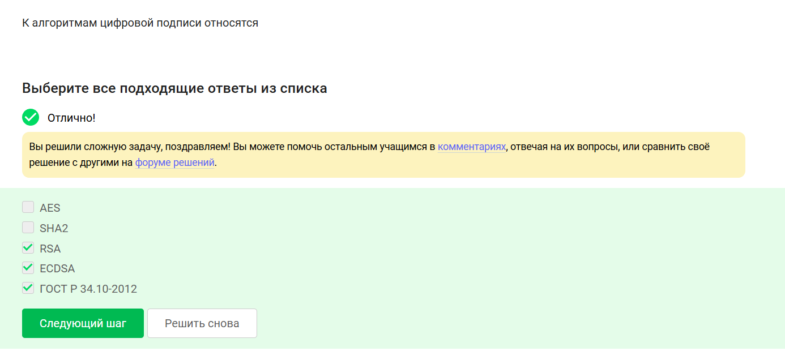
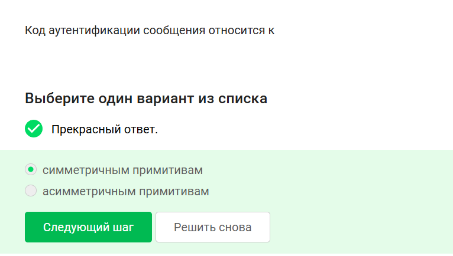
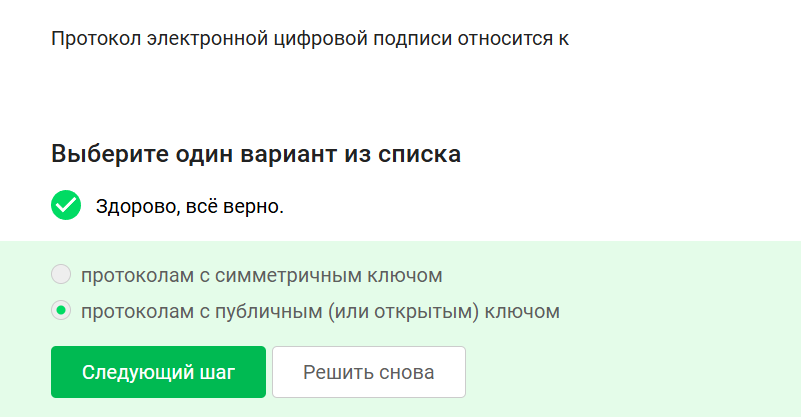
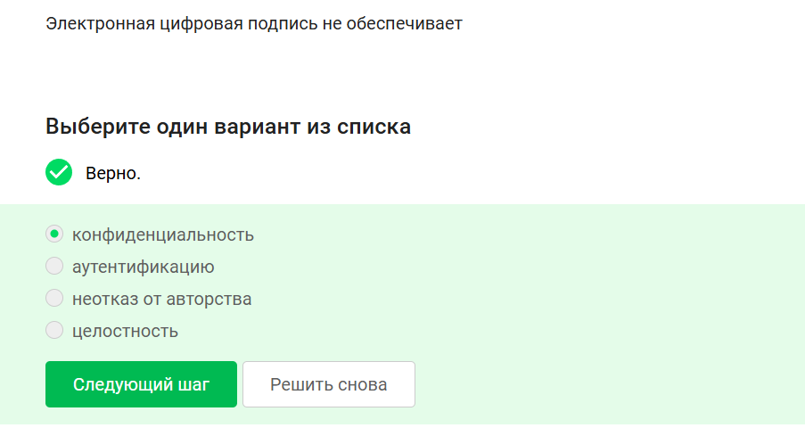
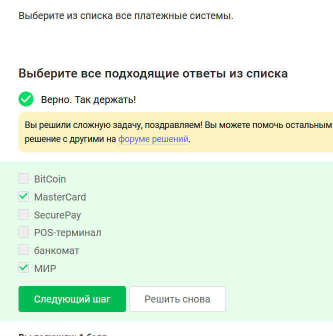
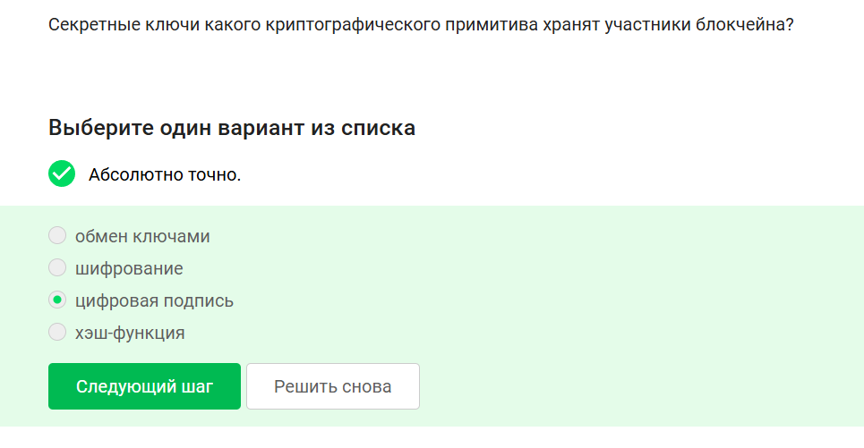

# 1. Асимметричные криптографические примитивы

**Правильный ответ: обе стороны имеют пару ключей.**

В асимметричной криптографии каждый участник генерирует пару: секретный (приватный) ключ и открытый (публичный) ключ. Открытый ключ распространяется, секретный хранится в тайне. Обе стороны имеют свои собственные пары — это позволяет шифровать для конкретного получателя (его открытым ключом) и подписывать своим секретным ключом. Вариант «общий секретный ключ» — это симметричная криптография. Вариант с одной парой у одной стороны неверен.

# 2. Криптографическая хэш-функция

**Правильные ответы: стойкая к коллизиям, даёт на выходе фиксированное число бит, эффективно вычисляется.**

Свойства криптографической хэш-функции:
- **Фиксированный размер выхода** (например, 256 бит) независимо от длины входа.
- **Эффективность вычисления** — хэш должен считаться быстро.
- **Стойкость к коллизиям** — невозможно найти два разных входных блока с одинаковым хэшем.
Хэш-функция **не обеспечивает конфиденциальность**, так как хэш необратим и не шифрует данные.

# 3. Алгоритмы цифровой подписи

**Правильные ответы: RSA, ECDSA, ГОСТ Р 34.10-2012.**

- **RSA** — может использоваться как для шифрования, так и для цифровой подписи (с разными схемами).
- **ECDSA** — алгоритм подписи на основе эллиптических кривых.
- **ГОСТ Р 34.10-2012** — российский стандарт электронной подписи.
- AES — алгоритм симметричного шифрования.
- SHA2 — семейство криптографических хэш-функций, не алгоритм подписи.

# 4. Код аутентификации сообщения (MAC)

**Правильный ответ: симметричным примитивам.**

MAC (Message Authentication Code) использует один секретный ключ для генерации и проверки кода аутентификации. И отправитель, и получатель знают общий секретный ключ. Это симметричный подход. В асимметричных примитивах используется пара ключей (цифровая подпись).

# 5. Обмен ключами Диффи-Хэллмана

**Правильный ответ: асимметричный примитив генерации общего секретного ключа.**

Протокол Диффи-Хэллмана позволяет двум сторонам получить общий секретный ключ, обмениваясь открытыми значениями по незащищённому каналу. Он не является алгоритмом шифрования. Хотя используются математические операции, подобные асимметричным (степень по модулю), результат — общий секретный ключ для симметричного шифрования. Называется асимметричным примитивом, потому что стороны используют разные закрытые и открытые значения.

# 6. Протокол электронной цифровой подписи

**Правильный ответ: протоколам с публичным (или открытым) ключом.**

ЭЦП использует пару ключей: секретный ключ для подписи, открытый ключ для проверки. Любой может проверить подпись, зная открытый ключ. Это классический асимметричный протокол. Симметричные протоколы для подписи не используются (кроме MAC, который не даёт свойства неотказуемости).

# 7. Алгоритм верификации ЭЦП

**Правильный ответ: подпись, открытый ключ, сообщение.**

Для проверки цифровой подписи нужны: исходное сообщение, сама подпись и открытый ключ подписанта. Секретный ключ не требуется и должен храниться в тайне. Алгоритм верификации вычисляет хэш сообщения и проверяет, соответствует ли подпись этому хэшу с использованием открытого ключа.

# 8. Что не обеспечивает ЭЦП

**Правильный ответ: конфиденциальность.**

ЭЦП обеспечивает:
- **Аутентификацию** — подтверждает, что подпись сделана владельцем секретного ключа.
- **Целостность** — любое изменение сообщения делает подпись недействительной.
- **Неотказуемость** — отправитель не может отказаться от своей подписи.
Конфиденциальность (секретность содержимого) ЭЦП не гарантирует — для этого нужно шифрование.

# 9. Сертификат для налоговой отчётности в ФНС

**Правильный ответ: усиленная квалифицированная.**

Для юридически значимого документооборота с государственными органами (ФНС) требуется усиленная квалифицированная электронная подпись (КЭП). Она создаётся и проверяется с использованием средств криптозащиты, аккредитованных ФСБ, и сертификат выдаётся удостоверяющим центром, аккредитованным Минцифры. Простая подпись не имеет силы, неквалифицированная подходит для внутреннего документооборота, но не для ФНС.

# 10. Где получить квалифицированный сертификат

**Правильный ответ: в удостоверяющем (сертификационном) центре.**

Квалифицированные сертификаты ключей проверки ЭП выдаются только удостоверяющими центрами, аккредитованными Министерством цифрового развития, связи и массовых коммуникаций РФ. Не любая организация с лицензией ФСБ подойдёт, нужна именно аккредитация в качестве удостоверяющего центра.

# 11. Платёжные системы

**Правильные ответы: MasterCard, МИР.**

Платёжные системы — это набор правил и инфраструктур для проведения безналичных платежей. Из списка:
- **MasterCard** — международная платёжная система.
- **МИР** — национальная платёжная система РФ.
BitCoin — это криптовалюта, но не платёжная система в классическом понимании (нет центрального оператора). SecurePay — это шлюз для платежей, а не система. POS-терминал и банкомат — это устройства, а не системы.

# 12. Примеры многофакторной аутентификации

**Правильные ответы: пароль + SMS-код, SMS-код + отпечаток пальца.**

Многофакторная аутентификация требует комбинации двух и более факторов из разных категорий (знание, владение, унаследование).
- Пароль (знание) + код в SMS (владение телефоном) — два фактора.
- Код в SMS (владение) + отпечаток пальца (биометрия) — два фактора.
- Пароль + капча — капча не является фактором аутентификации, это защита от ботов. PIN + пароль — оба из категории «знание», это однофакторная (два знания).

# 13. Аутентификация при онлайн-платежах

**Правильный ответ: многофакторная аутентификация покупателя перед банком-эмитентом.**

Современные онлайн-платежи (например, 3-D Secure) используют многофакторную аутентификацию. Покупатель подтверждает платёж перед банком, который выпустил карту (банк-эмитент), часто через пароль или биометрию плюс SMS-код или push-уведомление. Банк-эквайер — это банк продавца, аутентификация происходит перед эмитентом, а не эквайером. PIN-код карты — это однофакторная аутентификация только в терминалах, для онлайн не подходит.

# 14. Свойство хэш-функции в доказательстве работы (PoW)

**Правильный ответ: сложность нахождения прообраза.**

В доказательстве работы (Proof of Work), используемом в Bitcoin, участник должен найти такое значение (nonce), чтобы хэш от блока был меньше заданной цели. Это опирается на свойство **однонаправленности** (сложность нахождения прообраза): по хэшу невозможно восстановить вход, но проверить решение легко. Фиксированная длина выхода, целостность и эффективность — полезны, но не являются основой именно сложности подбора.

# 15. Свойства блокчейна (из списка)

**Правильные ответы: живучесть, открытость, консенсус.**

- **Живучесть (liveness)** — блокчейн продолжает работать даже при наличии некоторых сбойных узлов.
- **Открытость (openness)** — любой может присоединиться к сети, читать и писать транзакции.
- **Консенсус (consensus)** — механизм достижения согласия между узлами о состоянии реестра.
«Постоянства» нет, обычно говорят о неизменяемости (immutability), но в списке такого варианта нет.

# 16. Секретные ключи в блокчейне

**Правильный ответ: цифровая подпись.**

Участники блокчейна используют цифровую подпись (например, ECDSA) для подписания транзакций. Секретный ключ хранится у владельца и используется для создания подписи, подтверждающей право распоряжаться средствами. Хэш-функции не имеют секретного ключа, шифрование в блокчейне обычно не применяется (только в отдельных решениях), обмен ключами не является основным хранимым секретом.

# Заключение

В данном блоке были рассмотрены фундаментальные вопросы криптографии: асимметричные и симметричные примитивы, хэш-функции, цифровая подпись, сертификаты. Также затронуты практические темы: многофакторная аутентификация, платёжные системы, доказательство работы и свойства блокчейна. Понимание этих вопросов необходимо для грамотного применения средств защиты информации.
